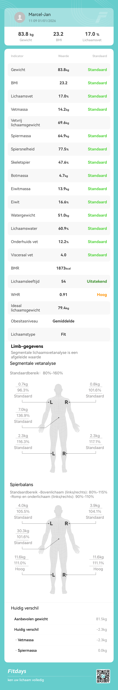

# extract_fitdays_data
Python code to extract data from the Fitdays app.

## The problem
The weight scales that I use (Robi S11) allows you to share its data, but only in the form of a jpg file.
That is not a format I can use to extract text from (that easily).

## My Python OCR solution
This Python code does Object Character Recognition (OCR) with PyTesseract. And it writes the data to a sqlite
database, where I can query the data to my hearts content.

## Language
This solution works with the Dutch version of the Fitdays app, which produces jpgs with Dutch language.
For another language you'll need to change the names of fields etc.

## Locations
I also use my own locations for where the jpgs are Airdropped to and where I want to move the jpgs to for backups.

